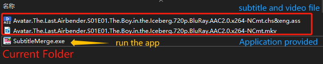
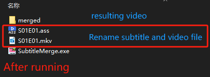

# SubtitleMerge

## Usage

> Ensure that the subtitle and video files , along with the application, are placed in the same directory~

## Introduction

Application packed by `Pyinstaller` and source code are available there.

Before running the project, there are several things you should be aware of:

1. Filter videos by their file name extension（either ’.mkv‘ or '.mp4'）

2. Match corresponding subtitle file by **video name`s prefix** 

3. Rename subtitle and vedio files by matching patterns using regular expressions

   **The regular expression used is `S\d+(E\d+)+`**

4. Execute the command to generate resulting videos which are saved in `merged` subfolder within the current folder

## Environment

The whole project is based on the Python Standard Library.and **installing `ffmpeg` is essential**.

Below is the [download link](https://www.ffmpeg.org/) for `ffmpeg`. After downloading , be sure to add `ffmpeg` to your environment variables.

## Reference

1. [Imyukehan/SubtitleMergeMKV: 将ass字幕并入mkv (github.com)](https://github.com/Imyukehan/SubtitleMergeMKV)

